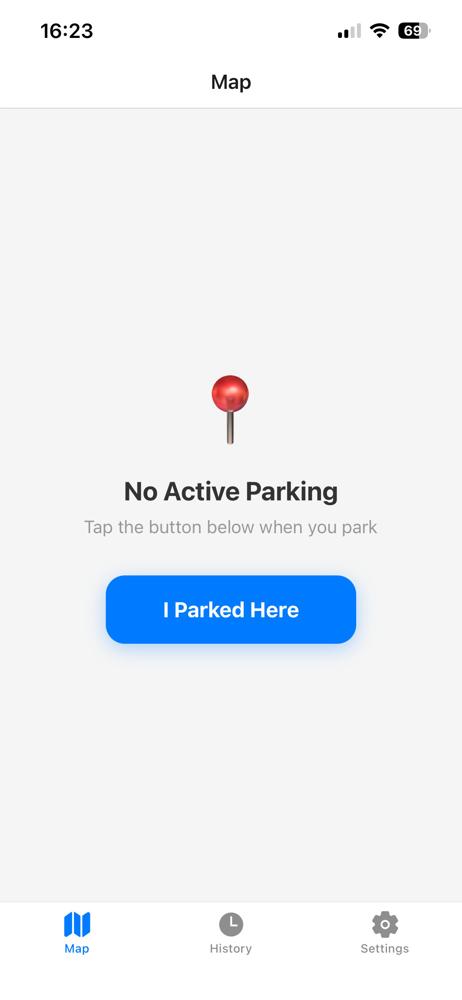
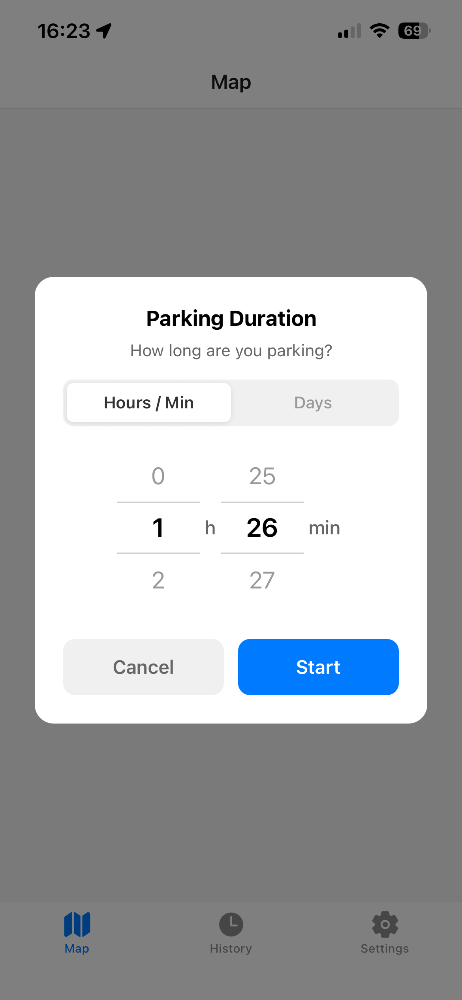
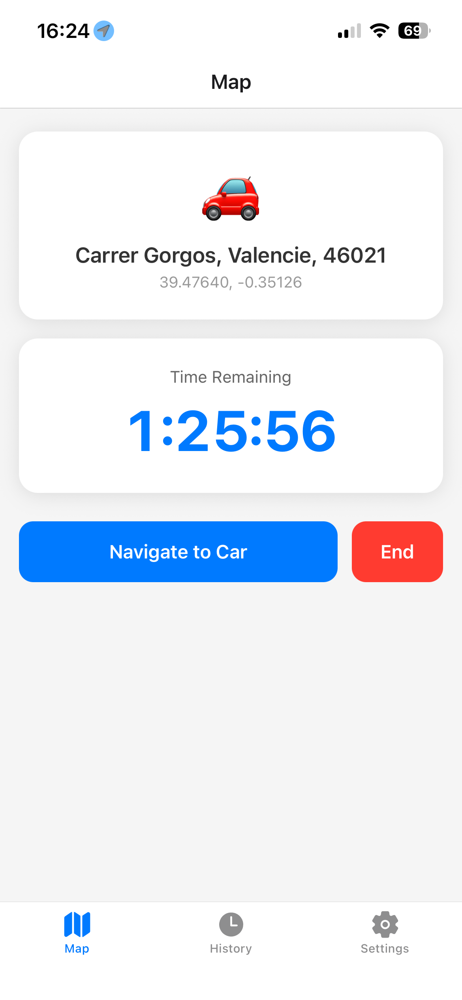
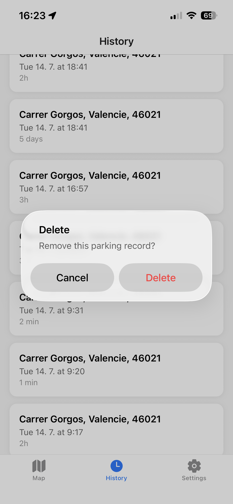
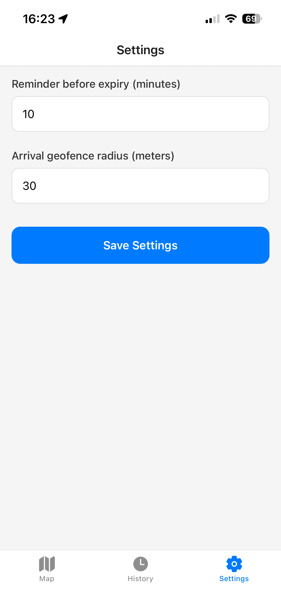

# ParkingReminder

A cross-platform parking reminder app for iOS and Android. Drop a pin when you park, set a timer, get notified before it expires, and navigate back to your car.

Built with React Native, Expo SDK 54, and TypeScript.

## Screenshots

  <p align="center">
    
    
    
    
    
  </p>
  
## Features (v1)

- Save parking location with one tap
- Duration picker (hours/minutes wheel + days option)
- Live countdown timer
- Push notification before parking expires
- Navigate to car via native Maps app
- Parking history
- Configurable reminder time and geofence radius

## Getting Started

### Prerequisites

- [Node.js](https://nodejs.org/) (v18+)
- [Expo Go](https://apps.apple.com/app/expo-go/id982107779) app on your iPhone (SDK 54)

### Install & Run

```bash
npm install
npx expo start
```

Scan the QR code with your iPhone camera to open in Expo Go.

### Type Check

```bash
npx tsc --noEmit
```

## Project Structure

```
app/                  # Screens (Expo Router, file-based routing)
  (tabs)/
    index.tsx         # Main screen — parking session UI
    history.tsx       # Past parking sessions
    settings.tsx      # App settings
src/
  components/         # Reusable UI (TimePicker, WheelPicker)
  services/           # Business logic (location, notifications, parking)
  storage/            # Data layer (AsyncStorage, repository pattern)
  types/              # TypeScript interfaces
```

## Notes

- **SDK 54** is used because the iOS App Store Expo Go only supports this version. Will be upgraded to latest when publishing via EAS Build.
- **No map view yet** — `react-native-maps` requires a native build. Currently uses a card-based UI.
- **Geofencing** is wrapped in try/catch — it only works in dev/production builds, not Expo Go.

